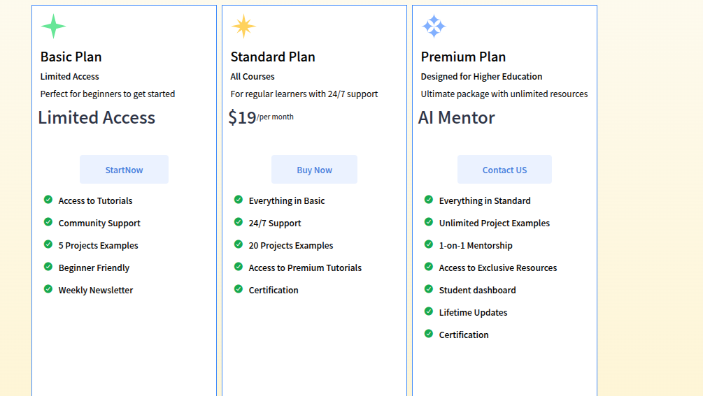

# Code-fusionary-pricing-plans


---

## 📂 Project File Structure  
```
code-fusionary-pricing-plans/
  
│── assets/                
│   └── icon/
│       └── favicon.jpeg 
│── Demo-pic.jpg
│── header.jpeg 
│── header-pic.jpeg  
│── svg/            # Folder for svg images
│   ├── blue-spark.svg
│   ├── green-spark.svg
│   ├── sparkle.png
│   ├── yellow-spark.svg
│   │── Previews/ 
│   ├── preview-1.png
│   ├── preview-2.png
│── index.html             # Main HTML file  
│── style.css              # Main CSS file  
│── responsive.css        # responsive CSS file
│── script.js              # Main Js file  
│── README.md              # Project documentation  
```

---


## 🚀 Features  

- ✅ **Gradient Background** for a stylish and modern look  
- ✅ **Responsive Layout** that works on all devices  
- ✅ **Interactive Pricing Boxes** with toggleable monthly/yearly options  
- ✅ **Social Links Integration** for easy connectivity  
- ✅ **Hover Animations** on images and buttons for better UX  

---

## 🛠 Technologies Used  

- **HTML5** – Semantic and structured webpage elements  
- **CSS3** – Styling, flexbox, transitions, hover effects, responsive design  
- **JavaScript (ES6)** – Dynamic content, toggle buttons, interactive pricing  
---

---
👉 [Visit the Website](https://code-fusionary-pricing-plans.vercel.app/)
---

## 📸 Preview  Main Section
  

## 📸 Preview  footer Section
  


---

## 💡 Usage

1. Clone the repository:
```bash
git clone https://github.com/HasibCoderLab/code-fusionary-pricing-plans.git
```
### 🔹 Open in Browser  ### 🔹 Open in Browser  
Simply open `index.html` in your preferred browser.  

Customize plans, features, and styles as needed.


🤝 Contributing

🤝 Contributing

⭐ **Feel free to fork, star, and contribute!** Submit pull requests—any improvements to responsiveness, design, or functionality are welcome!
